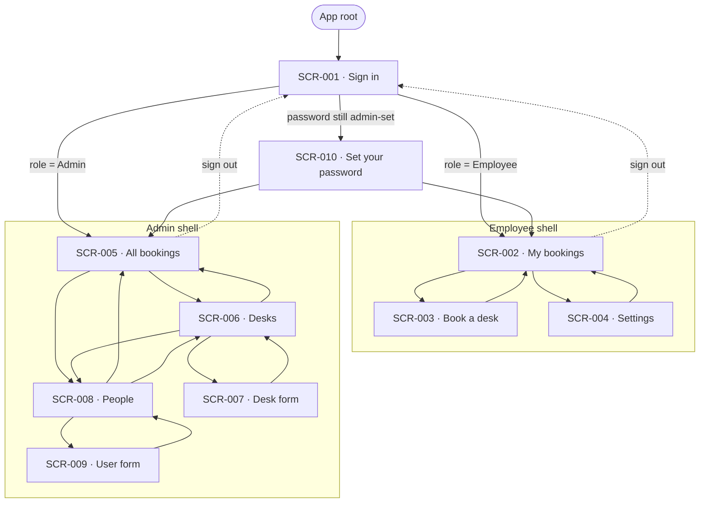
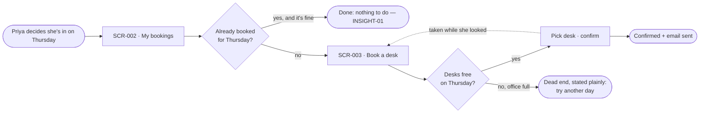
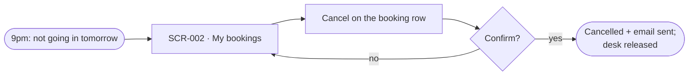
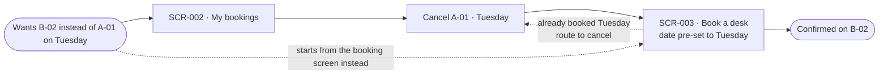
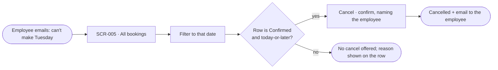
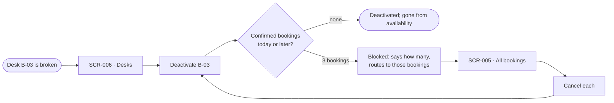
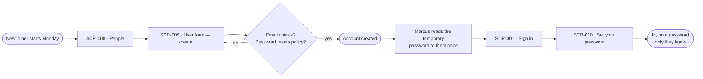
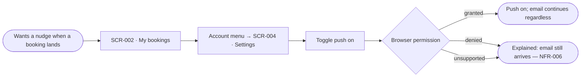

# Information architecture

> One durable file per product (`inception/design/ia.md`), extended per epic in the 2a PR. The screen inventory below is where `SCR-###` numbers are born — a screen not in this inventory has no business having a spec, and the sitemap is what makes an unreachable screen visible before CI has to say so.

**Covers:** BRD-001 — Employee Desk Booking System. Research: [`research/BRD-001-employee-desk-booking.md`](research/BRD-001-employee-desk-booking.md). Principles: [`principles.md`](principles.md).

## Grouping

Features grouped the way users think, in their vocabulary (research doc, Vocabulary table) — not the way the system is built. The grouping is role-dependent: BRD-001 gives every user exactly one role (REQ-004), so an employee and an administrator see different top-level groups inside the same shell.

| Group                    | Contains                                                                     | Nav label     |
| ------------------------ | ---------------------------------------------------------------------------- | ------------- |
| **My bookings** (P-1)    | What the employee currently holds; cancelling; booking history                | **Bookings**  |
| **Book a desk** (P-1)    | Pick a day, see what's free, take a desk                                     | **Book**      |
| **All bookings** (P-2)   | Every booking across employees; filter by date and status; cancel on behalf   | **Bookings**  |
| **Desks** (P-2)          | Desk inventory; add and edit desk numbers; activate and deactivate            | **Desks**     |
| **People** (P-2)         | User accounts; roles; deactivation; admin-initiated password reset            | **People**    |
| **Account** (both)       | Push alerts (employee only), your own details, sign out                       | account menu  |

Three groups per role, which is the point: an occasional administrator (A-6) can hold three items in their head, and an employee only ever sees two plus their account.

Deliberately _not_ a group: **Notifications.** Email is mandatory and unconfigurable (BR-001.13), and push is a single toggle (REQ-026). A "Notifications" section would advertise more control than the release actually offers — INSIGHT-07's warning against implying alerts that will not come.

## Sitemap

Ten screens, each with a `SCR-###`. Sub-views without their own ID: the cancel-confirmation dialog (a state on SCR-002 and SCR-005), the deactivation-confirmation and blocked dialogs (states on SCR-006 and SCR-008), and the reset-password result dialog (a state on SCR-008). Those are modal moments inside a job, not places you navigate to — they earn `ST-##` numbers, not `SCR-###` numbers.

**SCR-010 sits between sign-in and everything else**, and only for the two occasions when somebody else knows your password: the first sign-in on a newly created account, and the first sign-in after an administrator reset it (decided 2026-09-07). It has no shell — the navigation appears once the password is your own.

**Two shells, one pattern.** The employee and administrator shells are the same component with different items — one navigation to build, one to learn (INSIGHT-08). Sign-in and SCR-010 are the only screens outside a shell.

## Navigation model

**Pattern:** persistent sidebar on desktop, collapsing to a bottom bar on mobile. The account menu (sign out; Settings for employees) sits at the foot of the sidebar on desktop and behind an avatar in the top bar on mobile.

**Why this one:** P-2 visits occasionally and holds three unrelated jobs, so the nav has to say where he is and cost one click to switch — a hub-and-spoke home would tax every switch with a return trip (INSIGHT-08). P-1 books one-handed on a phone, where a bottom bar puts both her destinations inside thumb reach (INSIGHT-02, PRIN-4). Top tabs were rejected: at 360px, three tabs plus a date control plus status filters leaves nothing for content.

| Breakpoint     | Shell                                                            |
| -------------- | ---------------------------------------------------------------- |
| ≥ 1024px       | Persistent sidebar, columns 1–2; content columns 3–12            |
| 768–1023px     | Icon-only collapsed sidebar, labels on hover and focus            |
| < 768px        | Bottom bar with 2 items (employee) or 3 items (admin); avatar top-right |

**Open question — the middle breakpoint is designed but not verified.** This table
defines three shells; NFR-004 names only **360px and 1280px** as verification widths.
So the 768–1023px collapsed sidebar is a design commitment no requirement tests.
Either NFR-004 gains 768 as a third verification width, or this row is dropped and
the sidebar collapses straight to the bottom bar at 1024. **Owner: PO/BA (`/ba`)** —
it is a change to an approved requirement, not a design call. Until it is settled the
768 shell is drawn once per screen (see `wireframe-rules.md`), so the decision is
reviewable rather than theoretical.

## Critical paths

One diagram per job-to-be-done. Every screen in the inventory appears in at least one path.

### Path 1 — Book a desk for a day (P-1, the high-frequency job)

The zero-click outcome is a real outcome, not a failure of the flow: most visits end at Z.

### Path 2 — Plans changed, give the desk back (P-1)

Two taps from opening the app, no detail screen in between (INSIGHT-04).

### Path 3 — Different desk, same day (P-1, cancel-then-book by design)

BR-001.2 makes this two acts. The design's job is to keep them feeling like one errand: cancelling from SCR-002 hands SCR-003 the same date, and arriving at SCR-003 on a date already held offers the cancel rather than an error (PRIN-2).

### Path 4 — Admin cancels on someone's behalf (P-2)

### Path 5 — Retire a desk from service (P-2)

BR-001.9's hard block is the whole shape of this path: the refusal has to hand Marcus the way through, or he is stuck holding a broken desk (INSIGHT-06, PRIN-3).

### Path 6 — Onboard a new starter (P-2)

The last two steps exist because of the 2026-09-07 decision that an administrator-set password must be replaced at first use. Until then, Marcus kept a working credential for every account he created.

### Path 7 — Turn on push alerts (P-1)

## Screen inventory

The confirmed list. Each row becomes one `SCR-###` spec; `Reached from` / `Leads to` land in the spec and in `manifest.json` (`screens[].links_to`, `entry`).

| SCR-ID  | Screen                    | Level | Reached from                        | Leads to                                       | Serves                                                                                     |
| ------- | ------------------------- | ----- | ----------------------------------- | ---------------------------------------------- | ------------------------------------------------------------------------------------------ |
| SCR-001 | Sign in                   | L1    | `entry`                             | SCR-010 (password still admin-set), SCR-002 (Employee), SCR-005 (Admin) | REQ-001, REQ-002, REQ-005, NFR-003, NFR-004                            |
| SCR-002 | My bookings               | L1    | SCR-001, SCR-003, SCR-004           | SCR-003, SCR-004                               | REQ-003, REQ-009, REQ-010, REQ-024, REQ-028, NFR-001, NFR-004                              |
| SCR-003 | Book a desk               | L1    | SCR-002                             | SCR-002                                        | REQ-006, REQ-007, REQ-008, REQ-017, REQ-023, NFR-001, NFR-004                              |
| SCR-004 | Settings                  | L1    | SCR-002                             | SCR-002                                        | REQ-003, REQ-026, REQ-027, NFR-004, NFR-006                                                |
| SCR-005 | All bookings (admin)      | L1    | SCR-001, SCR-006, SCR-008           | SCR-006, SCR-008                               | REQ-003, REQ-011, REQ-012, REQ-013, REQ-014, REQ-024, REQ-028, NFR-001, NFR-004            |
| SCR-006 | Desks                     | L1    | SCR-005, SCR-008                    | SCR-005, SCR-007, SCR-008                      | REQ-015, REQ-016, REQ-017, NFR-004                                                         |
| SCR-007 | Desk form (add / edit)    | L2    | SCR-006                             | SCR-006                                        | REQ-015, REQ-016, NFR-004                                                                  |
| SCR-008 | People                    | L1    | SCR-005, SCR-006                    | SCR-005, SCR-006, SCR-009                      | REQ-004, REQ-018, REQ-020, REQ-021, REQ-022, NFR-004                                       |
| SCR-009 | User form (create / edit) | L2    | SCR-008                             | SCR-008                                        | REQ-004, REQ-018, REQ-019, REQ-022, NFR-004                                                |
| SCR-010 | Set your password         | L1    | SCR-001                             | SCR-002 (Employee), SCR-005 (Admin)            | REQ-002, REQ-018, REQ-021, NFR-003, NFR-004 — **plus a new requirement pending `/ba`**     |

**Requirements with no screen, on purpose.** REQ-025 (day-before reminder email) and NFR-005 (send reliability, failure logging) have no user interface in this release — the reminder is a scheduled job and the failure log is an operational concern. NFR-002 (single office) and NFR-007 (sender address is configuration) are likewise screenless. They are absent from the inventory because nothing renders them, not because they were missed.

**Screens this inventory deliberately does not contain:** a floor map (no requirement, and A-4 is unvalidated); a self-service password reset (explicitly out of scope, §10 of BRD-001 — SCR-010 is forced, never chosen); a notifications centre (see Grouping); a booking detail screen (INSIGHT-04 — a detail view is where cancel goes to hide); a Settings screen for administrators (decided 2026-09-07 — push is employee-only, so there would be nothing on it).
